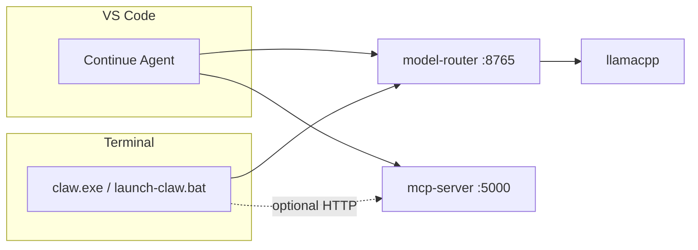

# Claw Code + Continue + AI.DEN

Two different **agent UIs** on the **same local stack** (Qwen via `model-router` on `:8765`). They do not nest inside each other; you pick a workflow or run both side by side.

## Architecture



| Tool | Where it runs | Best for |
|------|----------------|----------|
| **Continue** | VS Code panel | Edits, `@file`, `@problems`, `@terminal`, MCP tools in-repo |
| **Claw Code** | Terminal REPL | Long autonomous runs, git/commit flows, bash-heavy refactors |
| **AI.DEN MCP** | Docker `:5000` | Shared tools: `read_file`, `grep_search`, `library_docs`, `run_tests` |

Both should use **`http://localhost:8765/v1`** (coder router), **not** bare `:8081`, so **caveman/claw pipeline** applies.

## Claw Code (terminal)

### Start

1. `start-aiden.bat` (stack healthy)
2. `launch-claw.bat` — interactive REPL  
   Or one-shot: `launch-claw.bat prompt "refactor auth module"`

Profiles: `coder` (default), `general`, `vision`, `gateway`.

### Native binary (optional)

```powershell
cd claw-code-local\rust
cargo build -p rusty-claude-cli --release
set CLAW_BIN=C:\path\to\claw.exe
launch-claw.bat
```

### Same MCP tools as Continue (optional)

Claw can attach HTTP MCP servers in **`%USERPROFILE%\.claw\settings.json`** or **`<project>/.claw/settings.json`**.

Copy the example and adjust the port if needed:

```powershell
copy continue\claw.settings.example.json %USERPROFILE%\.claw\settings.json
```

Inside Claw: `/mcp` to list servers, then use MCP tools like Continue.

**Tool policy:** With MCP enabled, duplicate Claw builtins are **denied** in synced `~/.claw/settings.json` — use MCP tools instead. See **[tool-policy.md](tool-policy.md)**. Native **`bash`** stays for Windows host commands.

## Continue (VS Code)

1. `.\scripts\sync-continue-config.ps1` — also writes repo `CLAUDE.md` from `continue/rules.md` (Claw reads it on startup)
2. Reload Continue, **Agent** mode, model **AI.DEN Coder** or **AI.DEN Fast** (auto-routing uses fast tier for small prompts)
3. Enable MCP **AI.DEN Ollama MCP**

Repo layout: `@repo-map` (file list + optional signatures) + `@tree` (folder structure). See `docs/continue-repo-context.md`.

## Using both in one session

| Goal | Use |
|------|-----|
| Fix error on open file | Continue + `@problems` |
| Map repo then multi-file edit in IDE | Continue Agent + `@repo-map` (subfolder, not whole monorepo) |
| “Drive the repo from terminal for 20 steps” | `launch-claw.bat` in a VS Code terminal tab |
| Heavy verify | Continue `run_tests` MCP **or** Claw bash after edits |

There is **no** official “run Claw inside Continue” provider. Practical pattern:

- **Continue** for IDE-integrated work  
- **Claw terminal** (split pane) for harness-style agent loops on the same `OPENAI_BASE_URL`

`start-aiden.bat` can auto-open a Claw window (`AUTO_LAUNCH_CLAW=true` in `.env`).

## Slash prompt in Continue

After sync, use **`/Claw terminal`** in Continue chat — it reminds you to run `launch-claw.bat` for terminal-agent work.

## Environment (both)

```env
OPENAI_API_KEY=ollama
OPENAI_BASE_URL=http://localhost:8765/v1
```

`launch-claw.bat` sets these automatically. Continue gets `apiBase` from synced `config.yaml`.
